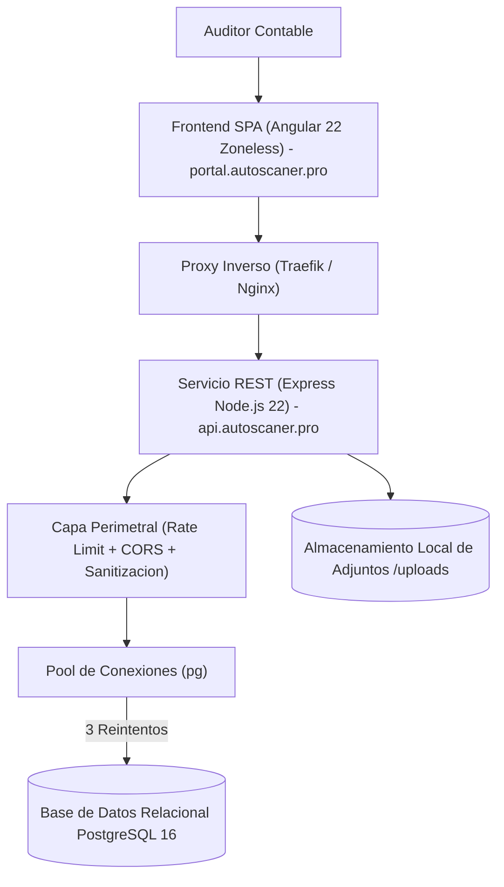
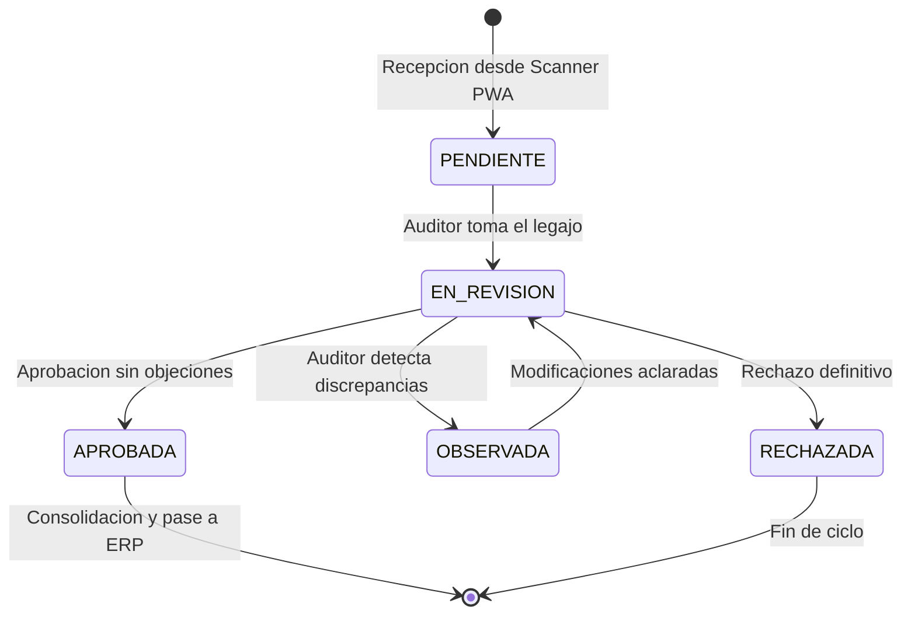

# Arquitectura del Sistema - ScannerValidator

Este documento describe la topologia, arquitectura en capas, modelo de datos relacional y medidas de seguridad del portal de auditoria y servicio de validacion Physis ScannerValidator.

---

## 1. Topologia de Tres Capas

ScannerValidator opera bajo un esquema desacoplado de tres niveles para garantizar alta disponibilidad, aislamiento de fallos y escalabilidad:

### Componentes de la Arquitectura
1. **Capa de Presentacion (Frontend SPA):** Construida en Angular 22 Zoneless con Signals reactivos. Servida mediante Nginx en contenedor Alpine optimizado.
2. **Capa de Servicios y Logica de Negocio (Backend Express):** Servicio Node.js 22 que centraliza los endpoints REST, gestiona el flujo de aprobaciones y valida las reglas de transicion de estados.
3. **Capa de Persistencia (PostgreSQL 16):** Motor de base de datos relacional ACID para la integridad de legajos, comprobantes y observaciones contables.

---

## 2. Maquina de Estados de Rendiciones

Cada legajo de rendicion transita a traves de un ciclo de vida formal y controlado por la API:

### Reglas de Transicion
- **PENDIENTE:** Estado inicial al recibir el paquete de comprobantes.
- **EN_REVISION:** Bloquea temporalmente el legajo para evitar colisiones entre multiples auditores.
- **APROBADA:** Requiere que todos los comprobantes individuales esten verificados con CUIT valido e importes concordantes.
- **OBSERVADA:** Genera un registro formal de observaciones tecnicas o administrativas con comentarios obligatorios.
- **RECHAZADA:** Cierre negativo del legajo con justificacion documentada.

---

## 3. Modelo de Datos Relacional (PostgreSQL)

El servicio inicializa automaticamente las tablas relacionales al iniciar si no existen previamente:

### Tabla: `rendiciones`
- `id` (VARCHAR(64), PRIMARY KEY): Identificador unico de la rendicion.
- `titulo` (VARCHAR(255), NOT NULL): Descripcion o concepto de la rendicion.
- `estado` (VARCHAR(32), NOT NULL, DEFAULT 'PENDIENTE'): Estado de validacion.
- `fecha_creacion` (TIMESTAMPTZ, DEFAULT NOW()): Marca temporal de creacion.
- `fecha_actualizacion` (TIMESTAMPTZ, DEFAULT NOW()): Ultima modificacion.
- `observaciones` (TEXT): Notas o requerimientos formulados por el auditor.
- `datos_adicionales` (JSONB): Atributos y metadatos complementarios.

### Tabla: `comprobantes`
- `id` (VARCHAR(64), PRIMARY KEY): Identificador unico del comprobante.
- `rendicion_id` (VARCHAR(64), REFERENCES rendiciones(id) ON DELETE CASCADE): Clave foranea.
- `tipo_comprobante` (VARCHAR(32), NOT NULL): Clasificacion fiscal.
- `cuit_emisor` (VARCHAR(20)): Identificador tributario del proveedor.
- `monto_total` (NUMERIC(14,2), NOT NULL): Importe liquidado.
- `fecha_emision` (DATE): Fecha del comprobante.
- `ruta_imagen` (TEXT): Ubicacion en disco del documento digitalizado.
- `estado_validacion` (VARCHAR(32), DEFAULT 'PENDIENTE'): Estado individual del item.

---

## 4. Politica de Conectividad y Resiliencia

El acceso a la base de datos PostgreSQL a traves de `server/db.js` cuenta con un mecanismo de reintentos configurado:
- En caso de interrupcion temporal en la conexion o reinicio del contenedor de base de datos, el cliente ejecuta exactamente 3 reintentos antes de devolver un error 503 al consumidor.
- El pool de conexiones esta parametrizado para liberar recursos ociosos y evitar el agotamiento de sockets.

---

## 5. Seguridad Perimetral y Proteccion de Datos

1. **Limitacion de Tasa (Rate Limiting):** Se aplican restricciones estrictas de peticiones por minuto en los endpoints de transicion de estado para mitigar intentos de saturacion.
2. **CORS Restrictivo:** La API Express solo admite solicitudes originadas desde los dominios autorizados (`portal.autoscaner.pro` y entornos locales definidos).
3. **Manejo Seguro de Excepciones:** Los controladores capturan errores internos sin exponer trazas de ejecucion (`stack trace`) al cliente HTTP en entornos productivos.
