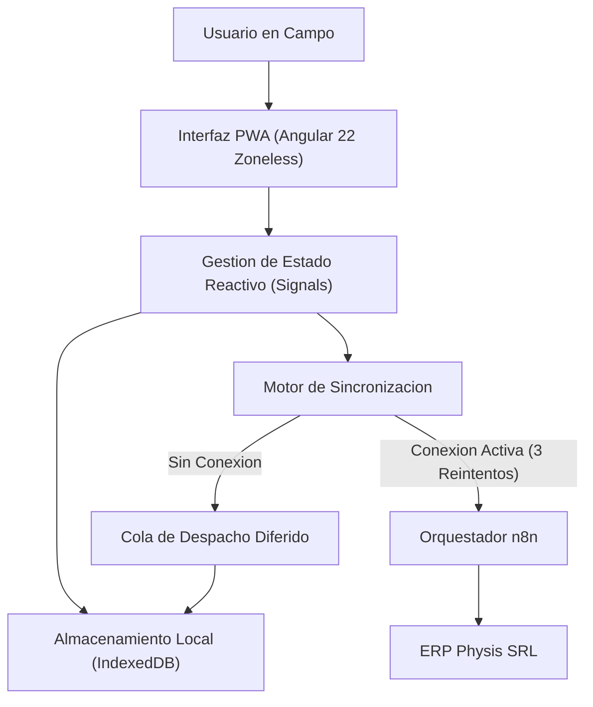
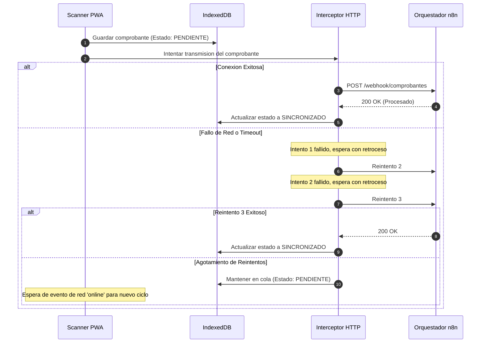

# Arquitectura del Sistema - Physis Scanner PWA

El presente documento detalla la topologia tecnica, decisiones de diseno estructural y mecanismos de procesamiento de la aplicacion cliente Physis Scanner PWA (`autoscaner.pro`).

---

## 1. Vision General y Principios de Diseno

Physis Scanner es una aplicacion web progresiva de una sola pagina (SPA/PWA) disenada para brindar una experiencia de usuario fluida, reactiva y resiliente en dispositivos moviles y de escritorio, optimizada especificamente para situaciones de conectividad limitada en campo.

### Pilares Arquitectonicos
- **Angular 22 Moderno y Zoneless:** Eliminacion de Zone.js en favor del mecanismo nativo de Angular basado en Signals, reduciendo la sobrecarga de deteccion de cambios y el peso del paquete final.
- **Enfoque Offline-First:** Las operaciones de captura, visualizacion y edicion de comprobantes no dependen de una conexion continua; los datos se persisten localmente de inmediato.
- **Desacoplamiento de Logica de Negocio:** La aplicacion no ejecuta inferencia pesada de IA ni validaciones contables complejas en el cliente; estas responsabilidades residen en flujos modulares de n8n y en los servicios centrales de Physis SRL.
- **Tipado Riguroso:** Implementacion estricta de contratos TypeScript sin admision del tipo `any`.

---

## 2. Capa Reactiva y Gestion de Estado

La arquitectura de estado se apoya completamente en Signals de Angular (`signal`, `computed`, `effect`), garantizando granularidad en las actualizaciones del DOM y eliminando fugas de memoria asociadas a suscripciones no controladas de Observables.

### Flujo de Estado de un Comprobante
1. **Captura:** El sensor de camara o selector de archivo genera un archivo binario.
2. **Preprocesamiento:** Se genera una imagen optimizada y se asigna un identificador UUID unico.
3. **Persistencia Local:** Se almacena el comprobante en estado `PENDIENTE` dentro de IndexedDB.
4. **Despacho:** Si existe conexion, se transmite el payload al orquestador n8n.
5. **Transicion:** Al recibir confirmacion HTTP 200, el estado muta a `SINCRONIZADO`.

---

## 3. Arquitectura de Almacenamiento Offline (IndexedDB)

La persistencia local se estructura mediante IndexedDB utilizando un servicio wrapper especializado que garantiza transacciones atomicas.

### Estructura de Almacenes (Object Stores)

#### 1. Almacen de Comprobantes (`comprobantes`)
- **Clave Primaria:** `id` (cadena UUID).
- **Campos Principales:**
  - `fechaCaptura`: Marca temporal en formato ISO 8601.
  - `tipoComprobante`: Enumerador (`FacturaA`, `FacturaB`, `Ticket`, etc.).
  - `monto`: Valor numerico decimal.
  - `cuitEmisor`: Cadena numerica normalizada.
  - `imagenBlob`: Contenido binario del archivo capturado.
  - `estadoSincronizacion`: Estado (`PENDIENTE`, `EN_PROCESO`, `SINCRONIZADO`, `ERROR`).
  - `intentosEnvio`: Contador numerico de reintentos ejecutados.

#### 2. Almacen de Rendiciones (`rendiciones`)
- **Clave Primaria:** `id` (cadena UUID).
- **Campos Principales:**
  - `titulo`: Descripcion de la rendicion de gastos.
  - `fechaCreacion`: Fecha de apertura del legajo.
  - `comprobantesIds`: Arreglo de identificadores asociados.
  - `estado`: Estado del legajo (`BORRADOR`, `ENVIADO`, `APROBADO`, `RECHAZADO`).

---

## 4. Politica de Sincronizacion y Tolerancia a Fallos

La transmision de comprobantes hacia el backend orquestador se rige por un estricto protocolo de resiliencia:

### Reglas Inmutables de Red
- **Numero de Reintentos:** Exactamente 3 reintentos antes de diferir la sincronizacion.
- **Estrategia de Espera:** Retroceso exponencial con factor de dispersión para evitar sobrecarga del servidor.
- **Deteccion de Conectividad:** La aplicacion escucha activamente los eventos `online` del navegador para disparar la revision de la cola de pendientes.

---

## 5. Ciclo de Vida de Sesion y Seguridad

1. **Almacenamiento Volatil de Credenciales:** La aplicacion almacena tokens de sesion y claves efimeras exclusivamente en `sessionStorage` o variables en memoria. Al cerrar la pestana o finalizar la aplicacion, la sesion se invalida automaticamente sin dejar rastros en almacenamiento permanente.
2. **Proteccion contra Inyeccion:** Se evita estrictamente la manipulacion directa de `innerHTML`. Toda salida de datos se procesa mediante las directivas seguras del motor de plantillas de Angular.
3. **Encabezados de Seguridad (Nginx):** El servidor de distribucion estatica inyecta politicas de seguridad estrictas:
   - `Content-Security-Policy` restrictivo.
   - `X-Frame-Options: SAMEORIGIN` para prevencion de ataques de clickjacking.
   - `X-Content-Type-Options: nosniff`.
   - `Referrer-Policy: strict-origin-when-cross-origin`.
