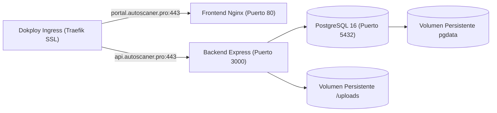

# Guia de Despliegue e Infraestructura - ScannerValidator

Este documento describe la orquestacion contenerizada, variables de entorno y procedimiento de despliegue en produccion de la plataforma ScannerValidator (`portal.autoscaner.pro` y `api.autoscaner.pro`) a traves de Dokploy.

---

## 1. Topologia Contenerizada y Orquestacion

ScannerValidator se orquesta como un conjunto de servicios interconectados mediante Docker Compose:



---

## 2. Variables de Entorno del Sistema

Cree un archivo `.env` en la raiz del despliegue del servidor o configure las siguientes variables en el panel de Dokploy:

```env
# Entorno General
NODE_ENV=production
PORT=3000

# Base de Datos PostgreSQL
DB_HOST=postgres
DB_PORT=5432
DB_NAME=scanner_validator
DB_USER=physis_user
DB_PASSWORD=ContrasenaSegura2026!

# Inteligencia Artificial (Google Gemini)
GEMINI_API_KEY=tu_clave_de_api_gemini
GEMINI_PRIMARY_MODEL=gemini-2.5-flash-lite
GEMINI_FALLBACK_MODEL=gemini-2.5-flash

# Politica CORS (Origenes autorizados separados por coma)
ALLOWED_ORIGINS=https://autoscaner.pro,https://portal.autoscaner.pro,https://api.autoscaner.pro
```

---

## 3. Definicion de Servicios (`docker-compose.yml`)

El archivo de orquestacion define los tres servicios coordinados:

```yaml
version: '3.8'

services:
  postgres:
    image: postgres:16-alpine
    container_name: scannervalidator-db
    restart: always
    environment:
      POSTGRES_DB: ${DB_NAME:-scanner_validator}
      POSTGRES_USER: ${DB_USER:-physis_user}
      POSTGRES_PASSWORD: ${DB_PASSWORD:-ContrasenaSegura2026!}
    volumes:
      - postgres_data:/var/lib/postgresql/data
    networks:
      - validator-network

  backend:
    build:
      context: ./server
      dockerfile: Dockerfile
    container_name: scannervalidator-api
    restart: always
    depends_on:
      - postgres
    environment:
      - NODE_ENV=production
      - PORT=3000
      - DB_HOST=postgres
      - DB_PORT=5432
      - DB_NAME=${DB_NAME:-scanner_validator}
      - DB_USER=${DB_USER:-physis_user}
      - DB_PASSWORD=${DB_PASSWORD:-ContrasenaSegura2026!}
      - GEMINI_API_KEY=${GEMINI_API_KEY}
      - ALLOWED_ORIGINS=${ALLOWED_ORIGINS}
    volumes:
      - uploads_data:/app/uploads
    networks:
      - validator-network

  frontend:
    build:
      context: .
      dockerfile: Dockerfile
    container_name: scannervalidator-web
    restart: always
    depends_on:
      - backend
    networks:
      - validator-network

volumes:
  postgres_data:
  uploads_data:

networks:
  validator-network:
    driver: bridge
```

---

## 4. Procedimiento de Despliegue en Dokploy

1. Ingrese a su consola de administracion Dokploy.
2. Cree un nuevo proyecto o aplicacion de tipo "Docker Compose".
3. Vincule el repositorio de GitHub: `BrianRuizMoreno/ticket-ofarrell`.
4. Configure los dominios y enrutamientos:
   - Dominio 1: `portal.autoscaner.pro` apuntando al servicio `frontend` en el puerto `80`.
   - Dominio 2: `api.autoscaner.pro` apuntando al servicio `backend` en el puerto `3000`.
5. Cargue las variables de entorno detalladas en la seccion 2.
6. Habilite la generacion de certificados SSL automaticos con Let's Encrypt.
7. Ejecute la accion "Deploy".

---

## 5. Politica de Respaldos y Verificacion de Salud

### Verificacion de Estado
Para constatar la correcta inicializacion del sistema, realice una peticion HTTP al endpoint de verificacion:
```bash
curl -I https://api.autoscaner.pro/api/health
```
Debe devolver `HTTP 200 OK` con `"status": "ok"` y `"postgres": true`.

### Copias de Seguridad de Base de Datos
Se recomienda programar una tarea cron diaria en el servidor anfitrion para respaldar el volumen PostgreSQL:
```bash
docker exec -t scannervalidator-db pg_dump -U physis_user scanner_validator | gzip > /backups/db_$(date +%Y%m%d).sql.gz
```
